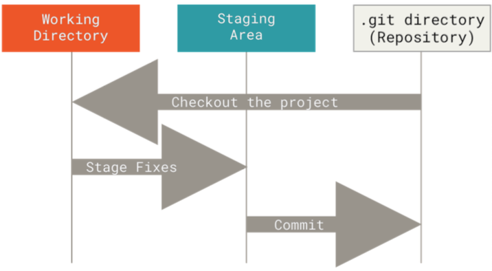
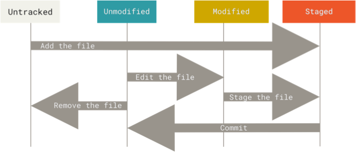

# Git Notes

Git thinks of its data like a **series of snapshots of a miniature filesystem**. Every time you commit, or save the state of your project, Git basically takes a picture of what all your file look like at that moment and stores a reference to that snapshot. To be efficient, if files have not changed, Git doesn't store the file again, just a link to the previous identical file it has already stored.

## Getting Started

### The Three States

Git has three main states that your files can reside in: *modified*, *staged*, and *committed*:

- **Modified**: you have changed the file but have not committed it to your database yet.

- **Staged**: you have marked a modified file in its current version to go into your next commit snapshot.

- **Commited**: the data is safely stored in your local database.

This leads us to the three main sections of a Git project: the *working tree*, the *staging area*, and the *Git directory*. 



The **working tree** is a single checkout of one version of the project. These files are pulled out of the compressed database in the Git directory and placed on disk for you to use or modify.

The **staging area** is a file, generally contained in your Git directory, that stores information about what will go into your next commit. Its technical name in Git parlance is the "index", but the phrase "staging area" works just as well.

The **Git directory** is where Git stores the metadata and object database for your project. This is the most important part of Git, and it is what is copied when you clone a repository from another computer. 

The basic Git workflow goes something like this:

1. You modify files in your working tree.

2. You selectively stage just those changes you want to be part of your next commit, which adds only those changes to the staging area.

3. You do a commit, which takes the files as they are in the staging area and stores that snapshot permanently to your Git directory.

### First-Time Git Setup

Git comes with a tool called git config that lets you get and set configuration variables that control all aspects of how Git looks and operates. These variables can be stored in three different places:

1. **[path]/etc/gitconfig** file: Contains values applied to every user on the system and all their repositories. If you pass the option `--system` to git config, it reads and writes from this file specifically.

2. **~/.gitconfig** or **~/.config/git/config** file: Values specific personally to you, the user. You can make Git read and write to this file specifically by passing the `--global` option, and this affects all of the repositories you work with on your system.

3. **.git/config** (config file in the Git directory): Specific to that single repository. You can force Git to read from and write to this file with the `--local` option, but that is in fact the default. You need to be located somewhere in a Git repository for this option to work properly.

#### Your Identity

The first thing you should do when you install Git is to set your username and email address. This is important because every Git commit uses this information, and it's immutably baked into the commits you start creating:

```bash
$ git config --global user.name "Javier Martín"
$ git config --global user.email javiermgimeno@gmail.com
```

If you want to override this with a different name or email address for specific projects, you can run the command without the `--global` option when you're in that project.

#### Your Editor

You can configure the default text editor that will be used when Git needs you to type in a message. If not configured, Git uses your system's default editor. If you want to use a different text editor, such as Vim, you can do the following:

```bash
$ git config --global core.editor vim
```

#### Your Default Branch Name

By default Git will create a branch called master when you create a new repository with `git init`. To set main as the default branch name do:

```bash
$ git config --global init.defaultBranch main
```

#### Checking Your Settings

You can use the `git config --list` command to list all the settings Git can find at that point.

```bash
$ git config --list
user.name=javiermgimeno
user.email=javiermgimeno@gmail.com
core.editor=vim
init.defaultbranch=main
...
```

### Getting Help

There are three equivalent ways to get the comprehensive manual page (manpage) help for any of the Git commands:

```bash
$ git help <verb>
$ git <verb> --help
$ man git-<verb>
```

For example, you can get the manpage help for the `git config` command by running this:

```bash
$ git help config
```

### Getting a Git Repository

You typically obtain a Git repository in one of two ways:

1. You can take a local directory that is currently not under version control, and turn it into a Git repository.

2. You can clone an existing Git repository from elsewhere.

#### Initializing a Repository in an Existing Directory

```bash
$ git init
```

This creates a new subdirectory named .git that contains all of your necessary repository files. At this point, nothing in your project is tracked yet. 

If you want to start version-controlling existing files (as opposed to an empty directory), you should probably begin tracking those files and do an initial commit. You can accomplish that with a few git add commands that specify the files you want to track, followed by a `git commit`:

```bash
$ git add *.c
$ git add LICENSE
$ git commit -m "Initial project version"
```

#### Cloning an Existing Repository

If you want to get a copy of an existing Git repository the command you need is `git clone`. For example:

```bash
$ git clone https://github.com/libgit2/libgit2
```

This creates a directory named libgit2, initializes a .git directory inside it, pulls down all the data for that repository, and checks out a working copy of the latest version. 

If you want to clone the repository into a directory named something other than libgit2, you can specify the new directory name as an additional argument:

```bash
$ git clone https://github.com/libgit2/libgit2 mylibgit
```

### Recording Changes to the Repository

Each file in your working directory can be in one of two states: *tracked* or *untracked*. **<mark>Tracked files</mark>** are files that were in the last snapshot, as well as any newly staged files; they can be unmodified, modified, or staged. In short, tracked files are files that Git knows about. 

**<mark>Untracked files</mark>** are everything else -- any files in your working directory that were not in your last snapshot and are not in your staging area. When you first clone a repository, all of your files will be tracked and unmodified because Git just checked them out and you haven't edited anything.

As you edit files, Git sees them as modified, because you've changed them since your last commit. As you work, you selectively stage these modified files and then commit all those staged changes, and the cycle repeats.



#### Checking the Status of Your Files

The main tool you use to determine wich files are in which state is the `git status` command.

```bash
$ git status
On branch master
Your branch is up to date with 'origin/master'.

nothing to commit, working tree clean
```

#### Tracking New Files

In order to begin tracking a new file, you use the command `git add`. To begin tracking the README file, you can run this:

```bash
$ git add README.md
```

If you run your status command again, you can see that your README.md file is now tracked and staged to be commited:

```bash
$ git status
On branch main
Changes to be committed:
  (use "git restore --staged <file>..." to unstage)
	new file:   README.md
```

#### Staging Modified Files

Let's change the README.md file, which was already staged. If you run the `git status` command again you get something like this:

```bash
$ git status
On branch main
Changes to be committed:
  (use "git restore --staged <file>..." to unstage)
	new file:   README.md

Changes not staged for commit:
  (use "git add <file>..." to update what will be committed)
  (use "git restore <file>..." to discard changes in working directory)
	modified:   README.md
```

To stage the modified README.md file, you run the `git add` command. `git add` is a multipurpose command -- you use it to begin tracking new files, to stage files, and to do other things like marking merge-conflicted files as resolved.

#### Short Status

If you run `git status -s` or `git status --short` you get a far more simplified output from the command:

```bash
$ git status -s
A  LICENSE
 M README.md
 M pruebas.py
?? otra_prueba.py
```

#### Ignoring Files

Often, you'll have a class of files that you don't want Git to automatically add or even show you as being untracked. These are generally automatically generated files such as log files or files produced by your build system. In such cases, you can create a file listing patterns to match them named .gitignore. Here is an example .gitignore file:

```bash
$ cat .gitignore
*.[oa]
*~
```

#### Viewing Your Staged and Unstaged Changes

What have you changed but not yet staged? And what have you staged that you are about to commit? Although `git status` answers those questions very generally by listing the file names, `git diff` shows you the exact lines added and removed. 